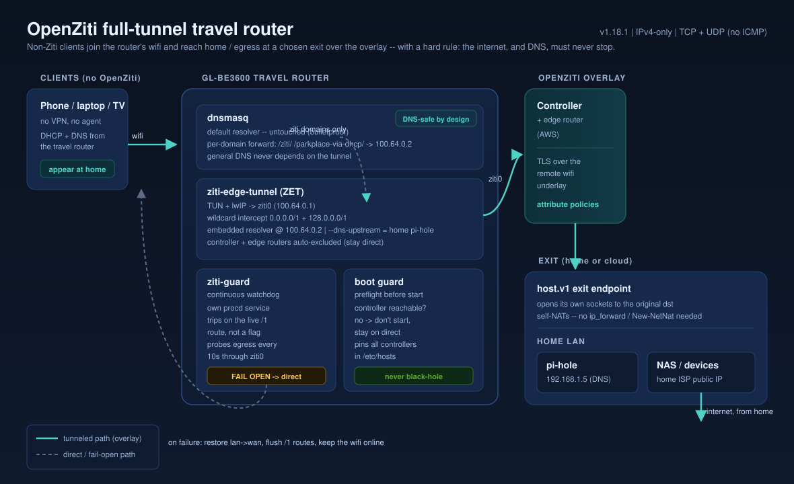

# Architecture

## Overview



The full-tunnel travel router carries all client traffic -- except the OpenZiti control/data underlay and the local
uplink -- through the overlay to a chosen exit, with a hard rule that the internet and DNS must never stop. Three
on-device pieces enforce that: `ziti-edge-tunnel` (ZET) is the dataplane; `ziti-guard` is a continuous watchdog that
falls open to direct internet if the tunnel stops carrying data; and the boot guard refuses to start the tunnel when
the controller is unreachable. DNS is wired in additively so general resolution never depends on the tunnel.

## Components

```
+--------------------+        +------------------------------+
|  luci-app-ziti     | -----> |  /etc/config/ziti (UCI)      |
|  (web UI, JS)      |        |  /etc/config/ziti-router     |
+--------------------+        +------------------------------+
        |                                |               |
        | rpcd "ziti" object              v               v
        v                     +------------------+  +------------------+
+----------------------+      | /etc/init.d/     |  | /etc/init.d/     |
| /usr/libexec/rpcd/   |----->| ziti-edge-tunnel |  | ziti-router      |
| ziti (shell backend) |      +------------------+  +------------------+
+----------------------+              |                       |
                                      v                       v
                          +----------------------+  +----------------------+
                          |  ziti-edge-tunnel    |  |  ziti-router         |
                          |  (C, all arches)     |  |  (Go, aarch64/x86_64)|
                          +----------------------+  +----------------------+
                                      |                       |
                                      v                       v
                              /etc/ziti/identities    /etc/ziti/router
```

Each daemon owns its own UCI file and init script. The LuCI app drives ZET only;
the router is configured out-of-band today (enroll via `ziti router enroll`),
with a future LuCI tab planned.

## Resilience + DNS pieces

Three helpers wrap ZET so full-tunnel mode can never black-hole the wifi, all living in
`/usr/libexec/ziti-boot-guard` (busybox sh) plus one extra procd service:

- **Boot guard (`ziti-boot-guard preflight`)** -- runs inside the ZET init before starting the daemon. It refreshes
  the `/etc/hosts` controller pins (every `ztAPI` + `ztAPIs[]` across enabled identities, re-resolved via direct DNS,
  in a marker-delimited block) and confirms a controller is reachable over the current uplink. If not, it falls open
  (restore `lan->wan`, flush any stray `/1` routes) and does NOT start ZET -- so the `/1` intercept never installs when
  the tunnel cannot work. `refresh-hosts` also runs on enroll.
- **Continuous watchdog (`ziti-guard` service -> `ziti-boot-guard watchdog`)** -- a SEPARATE procd service (so its own
  fall-open, which stops ZET, cannot kill it). It acts whenever a wildcard `/1` intercept is actually live on `ziti0`
  (route-based, not a UCI flag), probing egress through the tunnel every `watchdog_interval`; after `watchdog_fails`
  consecutive failures it runs `fall_open` (stop ZET, flush `0.0.0.0/1`+`128.0.0.0/1`, restore `lan->wan`) and STAYS
  open. This covers the mid-session case an exit dying while the tunnel is up.
- **DNS integration (`ziti-boot-guard dns-sync`)** -- programs dnsmasq to forward chosen domains to ZET's embedded
  resolver while leaving dnsmasq's own default upstream untouched (see the DNS design decision below).

`fall_open` is the single owner of every failure transition. Failure state is surfaced to LuCI status
(`guard_state`, `boot_failures`).

## UCI schema

`/etc/config/ziti` (ZET):

```
config ziti 'main'
    option enabled '1'
    option log_level 'INFO'    # ERROR | WARN | INFO | DEBUG | TRACE | VERBOSE
    # resilience watchdog (all optional; guard defaults apply if unset)
    option boot_verify '1'
    option max_boot_failures '3'
    list   watchdog_probes '1.1.1.1'
    option watchdog_interval '10'
    option watchdog_fails '3'
    # DNS integration (optional; off unless ziti_dns_domains is set)
    list   ziti_dns_domains 'ziti'
    list   ziti_dns_domains 'parkplace-via-dhcp'
    option dns_upstream '192.168.1.5'      # home resolver, reached over the tunnel
    option dns_resolver_ip '100.64.0.2'    # ZET's resolver (the .2 of the DNS range)

config identity
    option name 'home'
    option file '/etc/ziti/identities/home.json'
    option enabled '1'
```

`/etc/config/ziti-router`:

```
config router 'main'
    option enabled '0'
    option config '/etc/ziti/router/config.yml'
```

## procd service contract

- ZET runs as a single process iterating all enabled identities via
  `--identity-dir`. Rationale (in init script): only one tun device + one
  embedded DNS resolver per host; multiple ZET processes collide.
- Router runs as a single process bound to its YAML config; refuses to start
  without it (loud failure for unenrolled installs).
- Both use `respawn` with backoff and `procd_set_param stdout/stderr 1` so
  `logread` captures output.
- Reload triggers: ZET watches `/etc/config/ziti`; router watches
  `/etc/config/ziti-router`.

## Filesystem layout on device

```
/etc/config/ziti                   UCI config for ZET (conffile)
/etc/config/ziti-router            UCI config for router (conffile)
/etc/ziti/identities/*.json        enrolled ZET identities (conffile glob)
/etc/ziti/router/                  router config + state (conffile)
/usr/bin/ziti-edge-tunnel          ZET binary
/usr/bin/ziti                      router multi-call binary
/usr/bin/ziti-router               symlink -> ziti
/etc/init.d/ziti-edge-tunnel       procd init for ZET (preflight-gates, runs dns-sync, starts ziti-guard)
/etc/init.d/ziti-router            procd init for router
/etc/init.d/ziti-guard             procd service: continuous fail-open watchdog
/usr/libexec/rpcd/ziti             rpcd backend for LuCI
/usr/libexec/ziti-boot-guard       boot safeguard + watchdog + dns-sync (busybox sh)
/etc/ziti/boot-guard.state         last guard verdict (surfaced in LuCI status)
/etc/ziti/autostart-failures       consecutive boot-failure counter
/usr/share/rpcd/acl.d/             rpcd ACLs
/www/luci-static/resources/view/ziti/   LuCI views
```

## Design decisions

### Client-gateway engine: ZET (TUN) vs edge-router tproxy

For a full-tunnel gateway -- one box that pulls **all** client traffic into the overlay and egresses it
elsewhere -- OpenZiti offers two on-device engines. This repo uses `ziti-edge-tunnel` (ZET) for the client
gateway. The rationale, so it is not re-litigated:

- **ZET (TUN + lwIP).** ZET stands up a `tun` device and installs routes (for full tunnel, the split-default
  `0.0.0.0/1` + `128.0.0.0/1`) that steer matched flows into userspace, where lwIP proxies each TCP/UDP flow
  onto the overlay. A default-route (all-traffic) intercept is exactly what the TUN datapath is built for.
- **Edge-router tunneler (`mode: tproxy`).** The router's tproxy engine makes each intercepted CIDR *local*
  by doing `ip addr add <cidr> dev lo` and redirecting via the `NF-INTERCEPT` iptables chain. It has **no
  `tun` mode.** Point that at `0.0.0.0/0` (or even a `/1`) and the router treats *every* destination as local
  -- including its own controller control-channel -- and swallows its own uplink. tproxy is the right engine
  for a **defined set** of CIDR/hostname services, not for an all-traffic default route on the same box.

So: **ZET for the client gateway's full default route; edge-router tproxy for a bounded service set** (and it
is also the natural fit for the home/egress *host* side). An all-in-one edge-router LAN-gateway design does
exist and works for the bounded case -- single identity both dialing and hosting `0.0.0.0/1`+`128.0.0.0/1`,
`/32` DHCP leases for client isolation -- but it trades away a separate, centrally-managed egress chokepoint
and puts dial+bind on one key. That approach is documented externally (not carried in this repo, as it
depends on an external source); this note captures *why the travel-router path here does not use it*.

The full-tunnel runbook and its gotchas live in `docs/full-tunnel-travel-router.md` and
`docs/how-it-works-and-gotchas.md`.

### DNS integration: additive, never a single point of failure

Hard rule: general DNS must never break. DNS failures are the most visible outage a user can hit, so no design is
acceptable if normal name resolution can depend on a component that might fail (ZET, the tunnel, the exit).

- **dnsmasq keeps its own direct default resolver, untouched.** We only ADD per-domain forwarding of chosen domains
  to ZET's resolver (`server=/<domain>/<resolver-ip>`). If ZET/the tunnel is down, only those domains fail; everything
  else resolves via dnsmasq's default. There is no coupling to the watchdog/fall-open.
- **ZET's embedded resolver is at the `.2` of the DNS range (100.64.0.2 for the default 100.64.0.0/10), not `.1`.**
  `.1` is the tun's own local IP, delivered locally to nothing; `.2` routes into `ziti0` and is what ZET adds to
  `/etc/resolv.conf`. dnsmasq must forward there. `dns-sync` also adds `notinterface ziti0` so dnsmasq stops binding
  ziti0 and squatting the resolver address.
- **Home-vantage without a fragile default.** ZET is started with `--dns-upstream <home resolver>` (e.g. a home
  pi-hole on a home LAN IP). Non-Ziti names hitting ZET's resolver are forwarded there; because that IP is inside the
  wildcard intercept, the query rides the tunnel and resolves at home. Ziti service names resolve to synthetic
  `100.64.x` and tunnel directly. Public names not in the forwarded domains stay on dnsmasq's direct default.

Rejected alternative: pointing dnsmasq's ONLY upstream at ZET (to send all DNS home). That makes a ZET death a full
DNS outage -- exactly the single point of failure the hard rule forbids.
