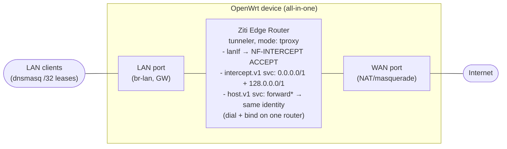

# OpenZiti Edge Router as a Full-Tunnel LAN Gateway (OpenWrt)

This guide configures a small OpenWrt device (one WAN port, one LAN/WiFi port) so that:

- The OpenZiti Edge Router (ER) runs in **tunneler mode** (`tproxy`) and acts as the network's **default gateway**.
- The ER's **dnsmasq/DHCP** server hands every LAN client a **/32 lease**, so a client's only usable route is to the ER itself — it cannot reach LAN peers directly, only through the gateway.
- An OpenZiti **service** is configured to capture **all IPv4 traffic** (via the split-default `0.0.0.0/1` + `128.0.0.0/1` CIDR pair) so every LAN client's traffic — not just specific hostnames/ports — is pulled into the Ziti overlay.

It uses the official `ziti-router-bin` OpenWrt package from [openziti/ziti-openwrt](https://github.com/openziti/ziti-openwrt) (see [`docs/installing.md`](https://github.com/openziti/ziti-openwrt/blob/main/docs/installing.md)) for installation and service management, and the `tunnel` listener options documented for `ziti-router` (`etc/router.config.reference.yml` in the core `ziti` repo) for the actual gateway/tproxy behavior.

---

## 1. Architecture



This is an **all-in-one** design: a single edge router identity both intercepts (`Dial`) and hosts/egresses (`Bind`) the same service — the pattern OpenZiti itself documents as a "router-embedded tunneler" (see `ziti/ziti/cmd/demo/setup-scripts/router-tunneler-both-sides.md`). Traffic still passes through the Ziti data plane (dial → fabric → bind, even though both ends are the same box), then the `host.v1` terminator opens the actual outbound connection, which leaves via the device's own WAN port under normal OpenWrt NAT/masquerade. There's no separate exit-node identity to stand up or maintain — at the cost of losing a separate, centrally-managed egress chokepoint (see §9).

---

## 2. Prerequisites

- OpenWrt **23.05+** device, **aarch64 or x86_64 only**, with at least two physical/logical ports (dedicated WAN, dedicated LAN/WiFi).
  **This is the binding constraint on "small":** the `ziti-router-bin` OpenWrt package ships the upstream prebuilt Go router binary (30–60 MB) and is only published for `aarch64` (e.g. GL.iNet GL-BE3600, IPQ5332-class boards) and `x86_64` — it is intentionally not built for `mips`/`mipsel`/`armv7` targets, and won't fit on classic 8/16 MB-flash routers even via `extroot`. Pick your device with this in mind; a small ARM SBC-class or x86 box is the realistic target, not a legacy home router.
- Root/SSH access to the device.
- Admin access to an OpenZiti network (controller) and the `ziti` CLI installed on your workstation, logged in (`ziti edge login ...`).
- An enrollment JWT for the edge router's identity.
- The `ziti-router-bin` package installed via `opkg` — either sideload a prebuilt `.ipk` or point the device at a published feed (see [`docs/installing.md`](https://github.com/openziti/ziti-openwrt/blob/main/docs/installing.md) §B). No manual cross-compilation needed:
  ```sh
  # sideload path — .ipk built/obtained on your workstation first
  scp ziti-router-bin_*_aarch64_cortex-a53.ipk root@192.168.1.1:/tmp/
  opkg install /tmp/ziti-router-bin_*.ipk
  ```
  This installs `/usr/bin/ziti` (the upstream multi-call binary), a `/usr/bin/ziti-router` symlink to it, the `/etc/init.d/ziti-router` procd service, and the `/etc/config/ziti-router` UCI file. If you'd rather build the `.ipk` yourself, the repo's `tools/build-sdk.sh -p ziti-router -t <target>` wraps the OpenWrt SDK and needs no Go toolchain on your side — it just downloads and repackages the upstream release tarball.

---

## 3. Base OpenWrt network layout

`/etc/config/network` — confirm WAN and LAN are on separate physical ports/zones (adjust device names to your hardware). LAN port + WiFi are bridged into `br-lan`, which is what `lanIf` in §5 points at:

```
config device
    option name 'br-lan'
    option type 'bridge'
    list ports 'eth0'                 # the LAN port; WiFi networks join this bridge via their own 'network' setting

config interface 'lan'
    option device 'br-lan'
    option proto 'static'
    option ipaddr '192.168.1.1'
    option netmask '255.255.255.0'

config interface 'wan'
    option device 'eth1'               # the dedicated WAN port
    option proto 'dhcp'                # or 'static' per your uplink
```

`/etc/config/firewall` — keep the default `wan` (masq, mtu_fix) / `lan` zone split, and confirm `masq` is on for the `wan` zone. In this all-in-one design the router's own `host.v1` terminator dials back out through its own WAN port, so it relies on that same NAT/masquerade rule for every LAN client's traffic, not just for locally-originated traffic. Traffic the Ziti tproxy layer intercepts is diverted before the normal FORWARD chain even sees it (it's redirected to a local socket); the LAN→WAN forwarding/masq rule matters for the re-egress leg out of the `host.v1` terminator and for anything not captured at all (see the IPv6 caveat in §7).

**Compatibility caveat:** OpenWrt 23.05+ defaults to `fw4`/nftables. OpenZiti's tproxy interception installs classic iptables rules (`mangle` table, `NF-INTERCEPT` chain). Verify these coexist on your target — either via the `iptables-nft` compatibility shim (usually present by default) or by installing `iptables-legacy` and running it alongside fw4. Test rule insertion (§8) before relying on this in production.

---

## 4. DHCP: hand out /32 leases so clients can only reach the gateway

`dnsmasq` — OpenWrt's default DHCP/DNS package, already installed on stock images — provides the DHCP server here; nothing to `opkg install` for this section. `/etc/config/dhcp` is its UCI config file.

**Why this works:** a client with a `/32` address has *no* directly-connected subnet route — from its own kernel's point of view, it is alone on the wire. It cannot ARP for or route to a peer "on the same LAN" because there is no local route that covers a peer's address. All non-self traffic, including to other LAN devices, therefore falls through to the default route, which points at the ER. This is the same "host route" / "unnumbered" trick used by several cloud providers for tenant isolation. No `proxy_arp` is required — the client only ever needs to ARP for the gateway's own IP, and the gateway answers that normally since it's genuinely on the shared L2 segment.

`/etc/config/dhcp` — LAN pool, overriding the subnet mask handed to clients and adding classless static-route options so clients that ignore option 3 in this configuration still get a working default route:

```
config dhcp 'lan'
    option interface 'lan'
    option start '100'
    option limit '150'
    option leasetime '12h'
    list dhcp_option '1,255.255.255.255'                 # option 1: subnet mask -> force /32
    list dhcp_option '3,192.168.1.1'                      # option 3: router (ER's LAN IP)
    list dhcp_option '121,0.0.0.0/0,192.168.1.1'          # option 121: classless static route (RFC 3442)
    list dhcp_option '249,0.0.0.0/0,192.168.1.1'          # legacy MS classless-route option, older Windows
    list dhcp_option '6,192.168.1.1'                      # option 6: DNS server -> the ER itself (see §6)
```

Test against your actual device mix (Windows, macOS, iOS, Android, IoT/embedded) — DHCP client handling of a router address outside the leased subnet varies, and option 121/249 support closes most of the gaps but not universally.

Sysctl hardening on the ER:

```bash
sysctl -w net.ipv4.ip_forward=1
sysctl -w net.ipv4.conf.all.accept_redirects=0
sysctl -w net.ipv4.conf.default.accept_redirects=0
sysctl -w net.ipv4.conf.default.send_redirects=0
```

`ip_forward=1` is still needed for anything that reaches the normal routing path (the `host.v1` terminator's own outbound connections re-egressing via WAN, non-intercepted protocols, IPv6 if you haven't disabled it — see §7).

---

## 5. Configure and enroll the Ziti Edge Router (tunneler mode)

`ziti-router-bin` installs the binary and its procd wrapper, but it doesn't enroll or configure the router for you — that part is manual.

1. On your OpenZiti controller, create the edge router and download its one-time enrollment JWT, then copy it to the device:
   ```bash
   scp router.jwt root@192.168.1.1:/etc/ziti/router/router.jwt
   ```

2. Write `/etc/ziti/router/config.yml` on the device:
   ```yaml
   v: 3
   identity:
     cert: /etc/ziti/router/identity.cert.pem
     server_cert: /etc/ziti/router/identity.server_cert.pem
     key: /etc/ziti/router/identity.key.pem
     ca: /etc/ziti/router/identity.ca_bundle.pem

   ctrl:
     endpoint: tls:<controller-host>:<ctrl-port>

   listeners:
     - binding: tunnel
       options:
         mode: tproxy
         resolver: udp://192.168.1.1:53      # see §6 — bind on the LAN IP, not loopback, for this use case
         dnsSvcIpRange: 100.64.0.1/10
         lanIf: br-lan                        # OpenWrt's LAN bridge device — see note below
   ```

   `lanIf` is the key setting for this scenario: "if defined in combination with `mode: tproxy`, the router will automatically add iptables `ACCEPT` rules to the `NF-INTERCEPT` chain in the `filter` table," allowing LAN-sourced traffic on that interface to be intercepted and matched against bound services. Without it, only traffic the router originates itself would be captured. Point it at whatever device carries your LAN traffic (`br-lan` if the LAN port and WiFi are bridged, per §3).

3. Enroll on the device:
   ```bash
   ziti-router enroll /etc/ziti/router/config.yml --jwt /etc/ziti/router/router.jwt
   ```

4. Enable and start the service via UCI:
   ```bash
   uci set ziti-router.main.enabled=1
   uci commit ziti-router
   /etc/init.d/ziti-router enable
   /etc/init.d/ziti-router start
   ```
   `/etc/ziti/router/` and `/etc/config/ziti-router` are conffiles, so they survive `sysupgrade`. Tail logs with `logread -e ziti-router`.

On the controller side, enable tunneling for this router's identity:

```bash
ziti edge update edge-router lan-gateway-router --tunneler-enabled
```

### Optional: multiple `lanIf`/`resolver` entries (ziti 2.1.0+, currently pre-release)

The upcoming 2.1.0 release ([`CHANGELOG.md`](https://github.com/openziti/ziti/blob/main/CHANGELOG.md), currently at `2.1.0-pre1`) lets both `lanIf` and `resolver` take a YAML list instead of a single value — one iptables `ACCEPT` rule is inserted per listed interface, and one shared resolver instance serves all listed addresses.

For the single-bridge design in this guide (`br-lan` carrying both the wired LAN port and WiFi, one subnet, one gateway IP) this doesn't change anything — a single `lanIf`/`resolver` already covers it. Where it's useful is if you'd rather **not** bridge wired and WiFi into one `br-lan` — e.g. to keep a distinct WiFi subnet for later per-network service policies — without giving up single-router full-tunnel capture on both:

```yaml
- binding: tunnel
  options:
    mode: tproxy
    lanIf:
      - eth0        # wired LAN, e.g. 192.168.1.0/24
      - wlan0       # WiFi, e.g. 192.168.2.0/24 — separate interface, no bridge
    resolver:
      - udp://192.168.1.1:53
      - udp://192.168.2.1:53
    dnsSvcIpRange: 100.64.0.1/10
```

Each interface would need its own `/etc/config/network` interface, DHCP pool (§4, still handing out `/32`s), and firewall zone. This is a genuine alternative to the bridged §3 layout if segmentation matters to you — not a requirement for the design as written.

**Caveat:** this needs a `ziti-router` binary built from the 2.1.0 pre-release, not a tagged release. The `ziti-router-bin` OpenWrt package pins a specific released upstream version and checksum in its Makefile (`PKG_VERSION`/`PKG_HASH`) — as of this writing that's a 1.6.x release, well before 2.1.0. To use this feature today you'd need to build your own `.ipk` against a 2.1.0 pre-release tarball (overriding those Makefile values yourself), rather than installing the published feed as-is. Revisit once 2.1.0 ships and the OpenWrt package picks it up.

---

## 6. DNS handoff

Because the config above binds the Ziti tunnel resolver on the LAN IP (`udp://192.168.1.1:53`) instead of loopback, and DHCP option 6 also points clients at `192.168.1.1`, the Ziti resolver becomes the LAN's DNS server directly — it answers intercepted-service hostnames with synthetic addresses from `dnsSvcIpRange` and forwards everything else upstream per `dnsUpstream` (add e.g. `dnsUpstream: 1.1.1.1` to the tunnel options).

Since dnsmasq's own DNS proxy would otherwise also try to bind port 53 on the same address, disable dnsmasq's DNS function while keeping its DHCP function — in `/etc/config/dhcp`, under the `config dnsmasq` section:

```
config dnsmasq
    option port '0'          # disables dnsmasq's DNS resolver; DHCP keeps working
```

**Upstream redundancy (2.1.0+, currently pre-release):** if you configure more than one `dnsUpstream` for resilience, the 2.1.0 pre-release adds a `dnsUpstreamMode` option controlling how they're queried. The existing/stable behavior (`parallel`) queries every upstream on every request — fine with one upstream, wasteful with two. `failover` queries one at a time, starting from whichever last answered, so a healthy upstream costs exactly one query regardless of how many are configured:

```yaml
- binding: tunnel
  options:
    mode: tproxy
    dnsUpstreamMode: failover
    dnsUpstream:
      - udp://1.1.1.1:53
      - udp://8.8.8.8:53
```

Same pre-release-version caveat as the multiple-`lanIf`/`resolver` note above applies — not available in the version the OpenWrt package currently pins.

---

## 7. OpenZiti service configuration: capture all traffic

This is the intercept.v1 / host.v1 pair that pulls everything the LAN sends into the Ziti overlay. The split-default technique (`0.0.0.0/1` + `128.0.0.0/1`, covering the full IPv4 address space as two halves) is the standard "route everything through the tunnel" pattern from VPN tooling (OpenVPN/WireGuard redirect-gateway), applied here to Ziti's `intercept.v1`/`host.v1` address lists.

**Dial-side config** (what the ER's tunneler matches and intercepts on the LAN):

```bash
ziti edge create config all-intercept intercept.v1 '{
  "protocols": ["tcp","udp"],
  "addresses": ["0.0.0.0/1","128.0.0.0/1"],
  "portRanges": [{"low":1,"high":65535}]
}'
```

**Bind-side (hosting/egress) config** — bound by the *same* router identity that dials it, using the `forward*`/`allowed*` fields so the terminator dynamically forwards to whatever destination the client actually requested, rather than a fixed address:

```bash
ziti edge create config all-host host.v1 '{
  "forwardProtocol": true,
  "allowedProtocols": ["tcp","udp"],
  "forwardAddress": true,
  "allowedAddresses": ["0.0.0.0/1","128.0.0.0/1"],
  "forwardPort": true,
  "allowedPortRanges": [{"low":1,"high":65535}]
}'
```

Service and policies — note both the `Dial` and `Bind` policies target the same `#lan-gateway-router` role, since one identity is doing both jobs:

```bash
ziti edge create service all-traffic --configs all-intercept,all-host -a all-traffic-svc

# Dial: who is allowed to intercept/consume this service — the LAN gateway router's own identity
ziti edge create service-policy all-traffic-dial Dial \
  --service-roles "@all-traffic" --identity-roles "#lan-gateway-router"

# Bind: who is allowed to host/egress this service — the SAME identity, all-in-one
ziti edge create service-policy all-traffic-bind Bind \
  --service-roles "@all-traffic" --identity-roles "#lan-gateway-router"

# Which edge routers the dial/bind identity may use
ziti edge create edge-router-policy all-traffic-erp \
  --identity-roles "#lan-gateway-router" --edge-router-roles "#all"

# Which edge routers may carry this service
ziti edge create service-edge-router-policy all-traffic-serp \
  --service-roles "@all-traffic" --edge-router-roles "#all"

# Tag the router's own identity so both policies above match it
ziti edge update identity lan-gateway-router --role-attributes lan-gateway-router
```

**On the two `/1` CIDRs alone being sufficient:** they already cover every IPv4 destination address, so nothing else is needed for full IPv4 capture. Hostname wildcards (e.g. `*.com`, `*.io`) only add value if you plan to split policy *by hostname category* later (e.g., different `allowedPortRanges`/inspection for `*.com` vs. everything else) — otherwise they're redundant given the CIDR coverage, since a specific address match and a CIDR match both resolve to the same destination.

**IPv6 warning:** these two ranges only cover IPv4. If the LAN is dual-stack, IPv6 traffic bypasses this capture entirely — a real leak, not just an inconsistency. Simplest mitigation: disable IPv6 on the LAN interface (`option ra 'disabled'`, `option dhcpv6 'disabled'` in `/etc/config/dhcp`'s `lan` section, and drop any ULA/GUA prefix delegation) so clients only get IPv4. If you need IPv6 support, you'll need an equivalent split-default for the IPv6 space and DHCPv6/RA handling on top of everything above — out of scope here.

---

## 8. Verification

- **On the ER**: check `ziti-router` logs for tproxy rule creation on startup; inspect `iptables -t mangle -L NF-INTERCEPT` and confirm entries matching the `0.0.0.0/1`/`128.0.0.0/1` destination ranges.
- **On a LAN client**: `ipconfig`/`ifconfig` should show a `/32` (`255.255.255.255`) mask with the ER as gateway; `route print`/`ip route` should show a single effective route through the ER.
- **Peer isolation**: `arp -a` on a client should only ever show the gateway's MAC address — never another LAN peer's, confirming clients truly can't reach each other directly.
- **Egress path**: `curl ifconfig.me` (or similar) from a LAN client should return the ER's own WAN public IP. To confirm traffic actually transited the Ziti data plane rather than just falling through to plain LAN→WAN forwarding, temporarily stop the `ziti-router` service and confirm the same client loses connectivity (since its only route is the now-unreachable ER, and nothing else is left to forward the packets).
- **DNS**: `nslookup` from a client should succeed and resolve through the ER (§6).

---

## 9. Security notes

- `AllowedSourceAddresses` on the intercept config restricts which *source* IPs get intercepted; if unset it defaults to `0.0.0.0/0` (any source) per the tunneler's own code. Leave unset here since every LAN client should be captured, but be aware of the default if you later need to exempt specific hosts.
- Because dial and bind live on the same identity, there's no separation of duty between "who can request traffic" and "who can egress it" — compromise of this one router's identity/key gives an attacker both. Weigh that against the centralized-inspection benefits you'd get from a separate exit-node identity (not used here, by design) — if that trade-off matters to you later, the only change needed is moving the `all-host` config's Bind policy to a different identity's role attribute.
- Re-read the IPv6 warning in §7 — it is the most likely accidental bypass of this whole setup.

---

## 10. Known limitations

- `ziti-router-bin` is aarch64/x86_64-only (§2) — this rules out classic small-flash mips/armv7 home routers as targets.
- fw4/nftables vs. legacy iptables interplay for the `NF-INTERCEPT` chain should be validated on your specific OpenWrt release before production use.
- DHCP option 121/249 support for a gateway outside the leased subnet varies by client OS/version — test your actual device mix.
- The `ziti-router-bin` package configures and enrolls the router out-of-band (manual `config.yml` + `ziti-router enroll`, §5); there's no LuCI UI for the router side yet (LuCI currently only manages `ziti-edge-tunnel`, a separate/simpler tunneling component not used in this guide).
